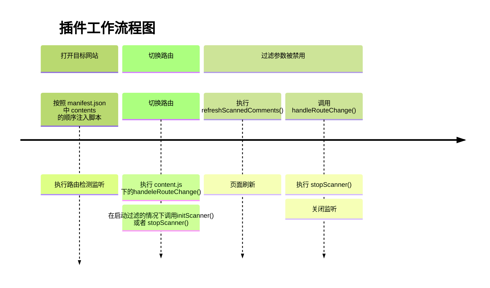
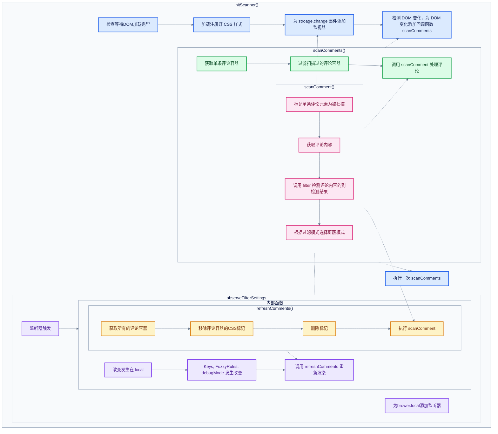
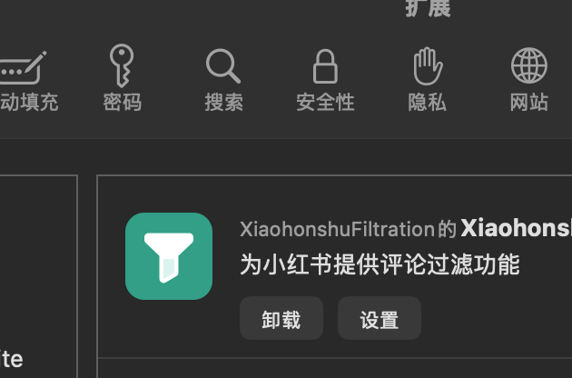

+++
date = '2026-09-27T18:30:36+08:00'
draft = true
title = '小红书评论过滤开发过程经历'
+++

# 小红书评论过滤开发过程经历

## 开发原因

因为最近在使用小红书的过程中发现小红书的环境开始出现很多令人不喜欢的冲突内容，虽然小红书有着非常优秀的推送算法和垃圾内容过滤，但是却依旧无法避免出现影响人心情的评论出现。  
为了解决被讨厌的评论内容干扰，所以我开发了一款 Safari 插件来进行过滤小红书评论

## 插件文件架构

文件架构

```text
root
    - macOS (App)
        - Base.iproj
        - AppDelegate.swift
    - macOS (Extension)
        - info.plist
    - Shared (App)
        - Assets.xcassets
        - Resources
        - ViewController.swift
    - Shared (Extension)
        - Resources
            - _locales
            - background
                - background.js
            - content
                - fuzzyAdapter
                    - fuzzyAdapterBase.js
                    - judge.js
                - comment_scanner.js
                - content.js
                - filter.js
                - page_detector.js
            - images
            - option
                - option_page.css
                - option_page.js
                - option_page.html
            - manifest.json
            - popup.css
            - popup.html
            - popup.js
        - SafariWebExtensionHandler.swift
    - XiaohongshuFiltration.xcodeproj
    - .gitignore
    - README.md
```

### 文件功能简要介绍

#### MacOS (App)

原生宿主 App，提供启动 App 时的原生UI，可以用于实现原生功能（该项目未使用该功能）

#### Shared (App)

宿主 App 的共享代码

#### Shared (Extension)

*Web* 拓展本体，大部分 Extensin 代码都在此处进行编写完成

*_locals* 在此文件夹中自定义扩展程序使用的国际化字符串，或添加其他语言

*images* 为拓展的图片资源，或者为您的扩展程序添加其他图片

*manifest.json* 自定义清单文件，负责 extension 的组织和配置

*background* 存放后台运行脚本，执行在拓展在网页和浏览器窗口之外的活动（此插件并为利用该功能）

*content* 存放实现网页评论扫描和过滤逻辑，网络服务，在启动网页时候注入脚本

*popup* 点击工具栏拓展按钮时的弹窗按钮，在此处负责添加过滤

*option* 存放设置页面的相关代码，设置页面点击 **Safari 设置 -> 拓展 -> XiaohongshuFiltraion -> 设置** 按钮进入

#### XiaohongshuFiltration.xcodeproj

xcode项目配置文件

## 插件工作流程



### content 部分

#### content.js

content.js 为入口文件（虽然实际上不存在任何入口文件，每个文件在打开匹配网站时都会被执行一次），在执行 content.js 后，首先监听browser.stroage区域的变化，在区域文件发生变化时候执行函数 *func_1* , 传入函数的 areaName 为 browser.stroage 发生改变的区域，可能的值分别为

- local 本地存储
- sync 同步存储（跨设备存储）
- managed 企业环境下的管理员管理存储

changes 接受的参数为描述更改对象参数，可能传递的内容为

```json
{
    "KeyMatche": {
        "oldValue": true,
        "newValue": false
    },
    "fuzzyMatche": {
        "oldValue": true,
        "newValue": false
    }
}
```

func_1 在接受参数后首先判断改变的区域参数是否为 “local”，然后是否包含需要关心的 “KeyMatche” 和 "fuzzyMatche"，然后更新 setting 的参数，之后调用一次 handleRouteChange() 来处理 KeyMatche 和 fuzzyMatche 的值都为 false 情况下的关闭监听, 不过实际上这里可以判断两个参数在同时为 false 的情况下单独调用一次 stopScanner()，在结尾处如果 ScannerStated 参数为 true 则执行一次 refreshScannedComment() 来进行更新评论过滤

```javascript
func_1(changes, areaName) => {
    if (areaName !== "local") {
        return;
    }

    if (!("KeyMatche" in changes) && !("fuzzyMatche" in changes)) {
        return;
    }

    settings = {
        ...settings,
        ...("KeyMatche" in changes && { KeyMatche: changes.KeyMatche.newValue === true }),
        ...("fuzzyMatche" in changes && { fuzzyMatche: changes.fuzzyMatche.newValue === true })
    };
    handleRouteChange();

    if (scannerStarted) {
        refreshScannedComments();
    }
}
```

在为 browser.stroage.onChange 事件添加监听器之后，执行一次 RouteObserver()，该函数重写了 history.pushState 和 history.replaceState 方法，使网站调用 history.push 和 history.replace 两个方法时触发自定义事件 `Event('xhs-route-event')`，然后同时监听 xhs-route-event 事件和 popstate 事件，在路由发生更改的时候将会执行 handleRouteChange() 来负责过滤评论任务。  
在执行 RouteObserver 后又会立刻执行一次 handleRouteChange 来负责处理过滤评论的任务，用于处理在网站已经加载后才注入 content.js 的情况

#### comment_scanner.js

comment_scanner.js 负责扫描评论，然后执行过滤

执行流程图如下



并且提供 stopScanner() 方法移除监听器，stopScanner 方法和 initScanner 都在外部进行调用。负责评论扫描初始化和评论扫描的关闭  
其中 ensureHiddenCommentStyle() 负责注入 CSS 规则。
scanComment 和 scanComments 负责评论，其中scanComments负责获取传入 DOM 的全部评论元素，并且过滤掉已经扫描过的评论元素，并将其传递给 scanComment 方法，scanComment 方法将标记评论为扫描然后获取评论内容判断是否过滤，在确认需要过滤之后根据是否为debug模式来确定处理结果，并标记为xhsRuleMatch = true（实际上未被读取过）。
observeFilterSettings() 则是负责为 browser.stroage的 onChange 事件添加监听器，每一次发生改变都将会执行 refreshScannedComments() 进行刷新评论，刷新评论时调用 scanComment 而不是 scanComments 防止被过滤掉

#### 其他文件

fuzzyAdapter 下的文件为模糊匹配接入的第三方模型商的接入适配器  
filter.js 文件为过滤的相关方法
page_detector.js 文件为检测页面，实际上未被调用

### popup 部分

popup 页面每次在点击 Safari 顶栏插件App图标时弹出页面。  
需要在 manifest.json 中配置为

```json
{
"action": {
        "default_popup": "popup.html",
        "default_icon": "images/toolbar-icon.svg" // 浏览器状态栏图标
    }
}
```

### option 部分

为 Safari 设置页面插件下的设置按钮点击后跳转页面



需要在 manifest.json 中配置为

```json
{
"options_ui": {
        "page": "option_page.html",
        "open_in_tab": true
    }
}
```

## 开发期间小问题

在 manifest.json 之中将脚本路径直接写为 content/content.js 等文件夹下层级写法在 Safari 中将导致浏览器无法找到路径，原因为 Xcode 打包工具会将文件拍平，所以 manifest.json 中文件脚本路径写法为

```json
{
    "content_scripts": [{
        "js": [
            "fuzzyAdapterBase.js",
            "judge.js",
            "filiter.js",
            "comment_scanner.js",
            "page_detector.js",
            "content.js"
        ],
        "matches": [
            "https://www.xiaohongshu.com/*",
            "https://xiaohongshu.com/*"
        ]
    }],
}
```
